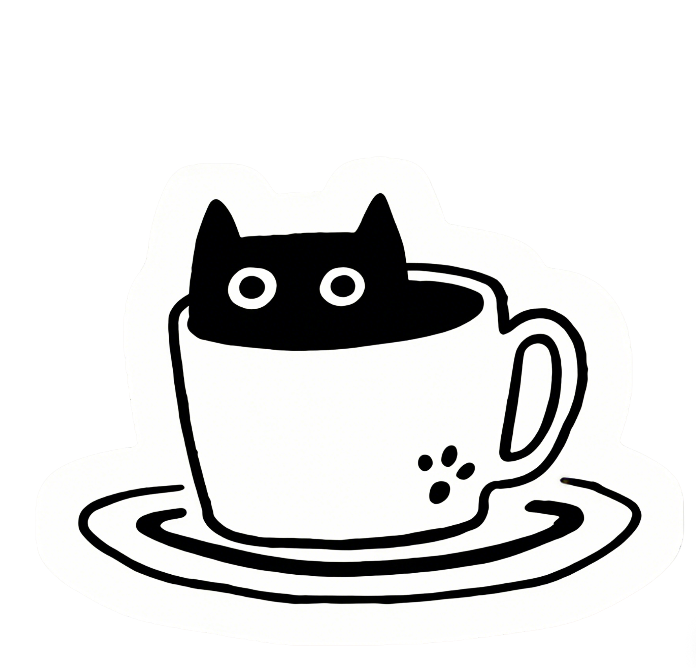
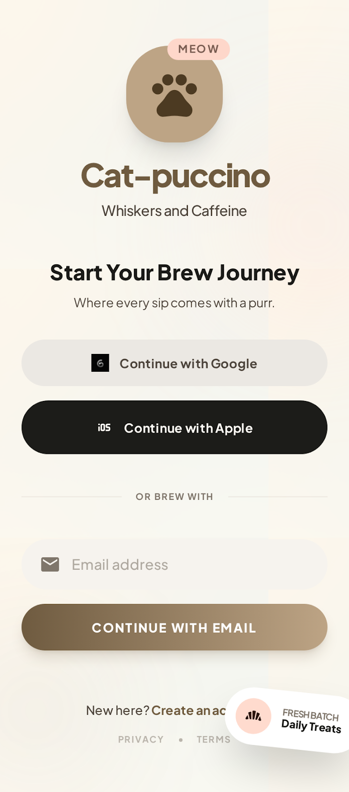
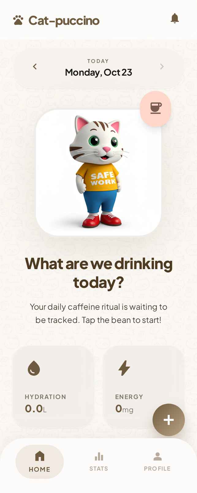
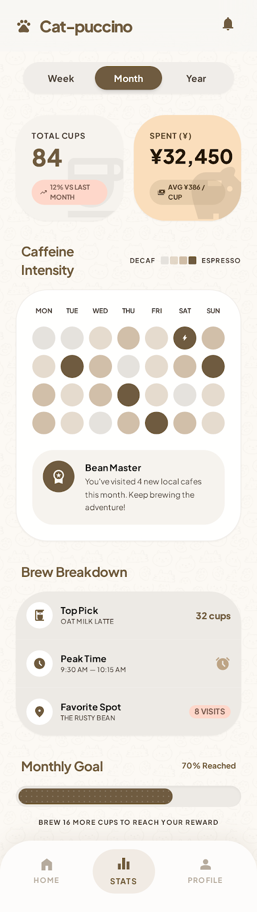
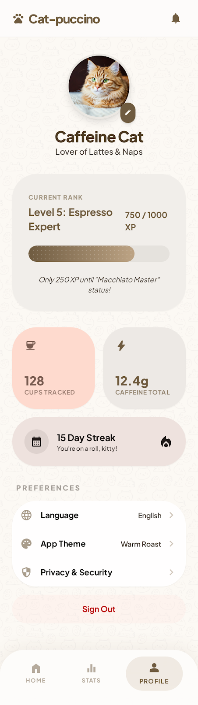

<div align="center">



# Cat-puccino Drink Tracker

**A cozy cat cafe-style drink diary for every sip, cup, craving, and tiny caffeine ritual.**

[English](#english) | [中文](#中文)


</div>

---

<div align="center">

| Login | Daily Log |
| --- | --- |
|  |  |

| Calendar & Stats | Profile |
| --- | --- |
|  |  |

</div>

---

## English

[Switch to 中文](#中文)

### The Idea

Cat-puccino Drink Tracker is a cozy, cat-themed drink tracking web app prototype for logging coffee, milk tea, juice, soda, and other daily beverages. It turns everyday drink logging into a soft little cafe ritual: record what you drank, collect visual memories, watch your stats grow, and let the app feel like a tiny pocket cafe.

The project is currently a static front-end app backed by Supabase. It runs directly in the browser, uses Supabase Auth for email/password accounts, stores drink data in Supabase Postgres, and keeps a small `localStorage` cache for smoother loading and demo mode.

### What Makes It Fun

<table>
  <tr>
    <td><strong>Cat Cafe Mood</strong><br />Creamy colors, espresso accents, rounded cards, and cat-inspired details make the tracker feel warm instead of clinical.</td>
    <td><strong>Sip Diary</strong><br />Every drink can include name, shop, price, category, sweetness, ice level, review, and a photo.</td>
  </tr>
  <tr>
    <td><strong>Progression</strong><br />XP, ranks, streaks, and lifetime stats give the app a light game-like loop.</td>
    <td><strong>Personal Dashboard</strong><br />Home modules can be reordered, resized, and saved, so the tracker feels like your own counter space.</td>
  </tr>
</table>

### Features

- Cat-themed login and onboarding flow
- Local demo account for quick exploration
- Daily drink logging with name, brand/shop, category, price, sweetness, ice level, photo, and personal review
- Home dashboard with daily summary cards
- Recent drink photo timeline
- Weekly, monthly, and yearly stats
- Calendar view for checking drink records by date
- Profile page with lifetime stats, streaks, and progression
- Rank and XP system to make tracking feel more game-like
- Customizable home layout with drag, reorder, resize, and saved preferences
- Notification panel and detail modal
- Privacy and terms modal content
- Mobile-first app-like interface

### Tech Stack

| Layer | Technology |
| --- | --- |
| Structure | HTML5 |
| Styling | CSS3, Tailwind CSS CDN |
| Interaction | JavaScript |
| Storage | Supabase Postgres, browser `localStorage` cache |
| Typography | Google Fonts: Plus Jakarta Sans |
| Icons | Google Material Symbols |
| Build | None required |
| Backend | Supabase Auth, Supabase Database, Row Level Security |

### How To Play

Cat-puccino is part drink tracker and part cozy collection game.

1. Open the app.
2. Create a local account, log in, or use the demo account.
3. Tap **Record Sip** to add a new drink.
4. Fill in drink name, brand, category, price, sweetness, ice level, and review.
5. Add a photo to build your visual drink timeline.
6. Check the home dashboard for today's cups and volume.
7. Visit the stats tab to compare weekly, monthly, or yearly habits.
8. Open the calendar to browse drinks by date.
9. Use the profile page to track lifetime progress, streaks, ranks, and achievements.
10. Customize the home dashboard layout until it feels just right.

Because the app uses local browser storage, all records stay on the current device and browser unless the data is cleared.

### Local Usage

Clone the repository:

```bash
git clone https://github.com/Brookell/cat-pu-c-ci-no.git
cd cat-pu-c-ci-no
```

Open `index.html` directly in a browser, or run a simple local static server:

```bash
python3 -m http.server 8000
```

Then visit:

```text
http://localhost:8000
```

### Project Structure

```text
.
├── index.html                 # Main interactive app prototype
├── black_cat.png              # Cat visual asset
├── cat-cup.png                # Cat cup visual asset
├── middle.png                 # Supporting image asset
├── login_screen/              # Login screen reference prototype and screenshot
├── home_daily_log/            # Home/daily log reference prototype and screenshot
├── calendar_stats/            # Calendar/statistics reference prototype and screenshot
├── user_profile/              # Profile screen reference prototype and screenshot
└── calico_cream/DESIGN.md     # Design system strategy
```

### Design Direction

The visual identity follows a warm boutique cafe mood: soft cream surfaces, espresso brown accents, plush rounded controls, layered cards, subtle texture, and cat-inspired details. The design goal is to feel friendly and comforting while still providing useful drink tracking tools.

Core design notes:

- Warm coffee and cream color palette
- Mobile-first app-like layout
- Soft rounded UI components
- Tonal layering instead of harsh divider lines
- Playful cat details that support the product personality
- A cozy dashboard experience designed for repeated daily use

### Data Storage

Signed-in accounts store profile and drink records in Supabase Postgres. Row Level Security is enabled so authenticated users can only access their own Cat-puccino rows. The app also uses browser `localStorage` for a lightweight cache, layout preferences, and local-only demo mode.

### Roadmap

- Add Supabase Storage for uploaded drink photos
- Replace base64 image records with storage-backed photo URLs
- Support cloud sync across devices
- Improve accessibility and keyboard navigation
- Add export/import for drink records
- Add richer charts and trend insights
- Add achievements and collectible cat badges
- Convert the static prototype into a component-based app
- Add automated tests

### License

No license has been specified yet.

---

## 中文

[切换到 English](#english)

### 项目概念

Cat-puccino Drink Tracker 是一个温暖、可爱、带有猫咪主题的饮品记录 Web App 原型。它可以用来记录咖啡、奶茶、果汁、汽水以及其他日常饮品，把“记录今天喝了什么”变成一个小小的咖啡馆仪式：记录饮品、收藏照片、查看统计、积累等级，让每一杯都留下痕迹。

当前项目是一个接入 Supabase 的静态前端应用，可以直接在浏览器中运行。它使用 Supabase Auth 进行邮箱/密码账号登录，使用 Supabase Postgres 存储饮品数据，并保留少量 `localStorage` 缓存用于更顺滑的加载和 Demo 模式。

### 有趣之处

<table>
  <tr>
    <td><strong>猫咪咖啡馆氛围</strong><br />奶油色背景、咖啡色强调、圆润卡片和猫咪细节，让饮品记录不再像冷冰冰的数据表。</td>
    <td><strong>饮品日记</strong><br />每杯饮品都可以记录名称、店铺、价格、分类、甜度、冰量、评价和照片。</td>
  </tr>
  <tr>
    <td><strong>成长系统</strong><br />XP、等级、连续记录天数和累计数据，让日常记录拥有轻量的游戏循环。</td>
    <td><strong>个人仪表盘</strong><br />首页模块可以拖拽、排序、调整大小并保存偏好，像整理自己的咖啡小桌面。</td>
  </tr>
</table>

### 项目功能

- 猫咪主题登录与引导界面
- 本地 Demo 账号，方便快速体验
- 每日饮品记录：饮品名称、品牌/店铺、分类、价格、甜度、冰量、图片和个人评价
- 首页仪表盘，展示当天饮品摘要
- 最近饮品图片时间线
- 周、月、年维度统计
- 日历视图，用于按日期查看饮品记录
- 个人主页，展示累计数据、连续记录天数和成长进度
- 等级与 XP 系统，让记录过程更有游戏感
- 首页布局自定义，支持拖拽、排序、调整大小并保存偏好
- 通知面板和通知详情弹窗
- 隐私政策与服务条款弹窗
- 移动端优先的 App 风格界面

### 技术栈

| 层级 | 技术 |
| --- | --- |
| 页面结构 | HTML5 |
| 样式 | CSS3, Tailwind CSS CDN |
| 交互 | JavaScript |
| 数据存储 | Supabase Postgres，浏览器 `localStorage` 缓存 |
| 字体 | Google Fonts: Plus Jakarta Sans |
| 图标 | Google Material Symbols |
| 构建工具 | 当前版本不需要 |
| 后端 | Supabase Auth，Supabase Database，Row Level Security |

### 玩法说明

Cat-puccino 既是一个饮品记录工具，也是一个轻量的温馨收集体验。

1. 打开应用。
2. 创建本地账号、登录已有账号，或使用 Demo 账号体验。
3. 点击 **Record Sip** 添加一杯新饮品。
4. 填写饮品名称、品牌、分类、价格、甜度、冰量和评价。
5. 可以上传饮品照片，建立自己的视觉饮品时间线。
6. 在首页查看当天杯数和总饮用量。
7. 进入统计页，对比周、月、年的饮品习惯。
8. 打开日历，按日期浏览记录。
9. 在个人页查看累计进度、连续记录天数、等级和成就。
10. 自定义首页模块布局，让应用更符合自己的使用习惯。

由于项目使用浏览器本地存储，所有记录默认只保存在当前设备和当前浏览器中。如果清除浏览器数据，或换设备/换浏览器使用，原有本地记录将不会自动同步。

### 本地运行

克隆仓库：

```bash
git clone https://github.com/Brookell/cat-pu-c-ci-no.git
cd cat-pu-c-ci-no
```

可以直接用浏览器打开 `index.html`，也可以启动一个简单的本地静态服务器：

```bash
python3 -m http.server 8000
```

然后访问：

```text
http://localhost:8000
```

### 项目结构

```text
.
├── index.html                 # 主交互应用原型
├── black_cat.png              # 猫咪视觉素材
├── cat-cup.png                # 猫咪杯子视觉素材
├── middle.png                 # 辅助图片素材
├── login_screen/              # 登录页参考原型与截图
├── home_daily_log/            # 首页/每日记录参考原型与截图
├── calendar_stats/            # 日历/统计页参考原型与截图
├── user_profile/              # 个人页参考原型与截图
└── calico_cream/DESIGN.md     # 设计系统策略文档
```

### 设计方向

项目视觉风格围绕温暖的精品咖啡馆氛围展开：柔和奶油色背景、浓缩咖啡色强调色、圆润柔软的控件、层叠式卡片、细腻纹理以及猫咪主题细节。设计目标是在保持实用饮品记录能力的同时，让应用本身也具有舒适、治愈、可持续使用的体验。

核心设计特点包括：

- 咖啡与奶油色系构成的温暖配色
- 移动端优先的 App 式布局
- 柔和圆润的 UI 组件
- 使用色块层级而不是生硬边框来区分内容
- 轻量猫咪元素，增强趣味但不干扰使用
- 适合每日反复打开的舒适仪表盘体验

### 数据存储

登录账号会把用户资料和饮品记录保存到 Supabase Postgres。项目已启用 Row Level Security，确保登录用户只能访问自己的 Cat-puccino 数据。浏览器 `localStorage` 仍用于轻量缓存、布局偏好和本地 Demo 模式。

### 后续计划

- 增加 Supabase Storage，用于保存上传的饮品照片
- 将 base64 图片记录升级为基于 Storage 的图片 URL
- 支持跨设备云同步
- 改进无障碍体验和键盘操作
- 支持饮品记录导出/导入
- 增加更丰富的数据图表和趋势洞察
- 增加成就系统和可收集猫咪徽章
- 将静态原型升级为组件化前端应用
- 增加自动化测试

### 许可证

当前项目尚未指定许可证。
